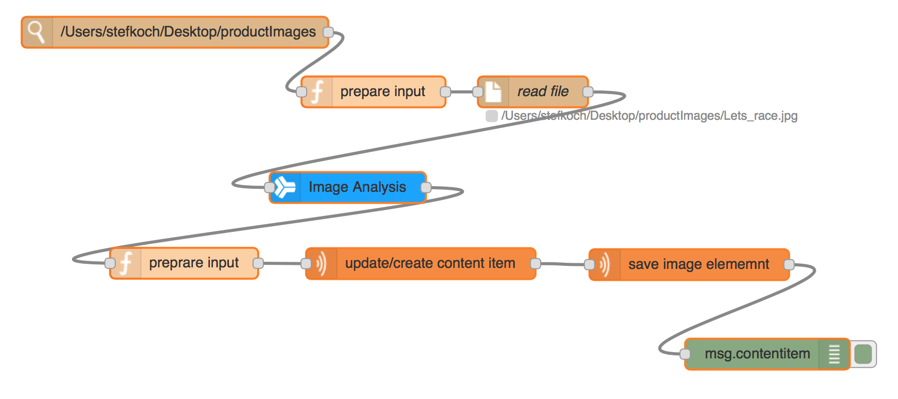

## node-red-contrib-digital-experience
This project delivers a set of node-red nodes working with the IBM Digital Experience platform.

### Installation
Navigate into your node-red folder and use the ```npm``` command to get the extension installed

    cd $HOME/.node-red/
    npm install git+ssh://git@github.com:digexp/Sample-Node-RED-dx.git

after the plugin is successfully installed restart your node-red process

### Usage
After a successful installation you should see a new section called Digital_Experience in the node section of the node-red editor.

All nodes have a detailed information provided in the info section. On a high-level the following functions are supported:
* ```dx-content-item```- the content item node supports the standard CRUD operations to work with IBM WCM content items. This node is not intended for updating content elements. The idea is to chain the ```dx-content-item```node with the ```dx-content-element``` node (See later).
* ```dx-content-element``` - This node supports reading and writing content elements for an existing content item. This node has support for multinode updates as well.
* ```dx-project``` - This node allows to add project support to the flow, so that any update is scoped to the given project.
* ```dx-content-query``` - This node allows to query content items based on the WCM query APIs

### Sample flow

The main purpose for this project was to build an integration to the Watson Alchemy APIs. Using Node-RED allows you to quickly build an integration of Watson Alchemy and IBM Web Content Manager APIs. on the image below you can see a very simple workflow which shows how an integration could look like. The sample flow listens to a given folder, once a new image gets dropped into that folder the flow passes the inpage data to Watson API and based on the result we create a new content item, upload the element and assign the Watson results to the content item's keywords.

The resulting sample flow would look like this



You can download the and import the flow from [here](./sample/sample_flow.json)

In case you want to make use of the sample flow you have to make sure you install the ```node-red-node-watson``` nodes by calling 

    cd $HOME/.node-red
    npm install node-red-node-watson


